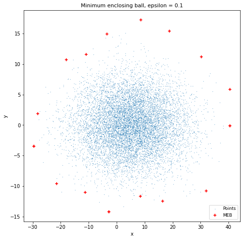
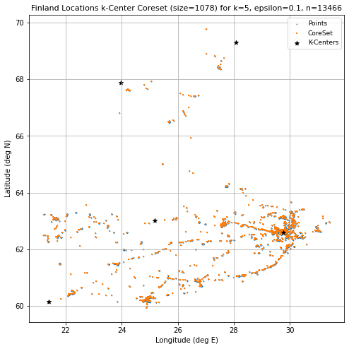
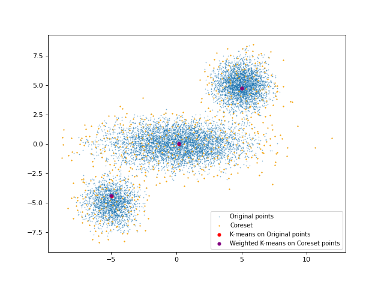

## Coreset Algorithms for Streaming & Clustering
------------------------------------------------------
Python implementation of various Coreset algorithms for clustering and streaming. The code in this repository can be used to generate Coresets for the following use-cases:
1. Median Estimation
2. k-Center Clustering
3. Minimum Enclosing Ball (MEB)
4. Gaussian Mixture Model (GMM)
5. Weighted GMM
6. Streaming Coresets (k-means/k-median)

 

### Implementation details and Running Code:
------------------------------------------------------
***k-center Clustering***
The `Coreset_kCenter` class in ```algorithms/coreset_kcenter.py``` contains the implementation of an epsilon-additive k-center clustering coresest algorithm.


***Gaussian Mixture Models***


***Streaming Algorithms***

K-means and K-medians algorithms have been implemented. The class that handles these algorithms is in `Coreset_Streaming` in  ```algorithms/coreset_streaming.py```.

The easiest way to simulate the streaming algorithm would be to run the ```run_stream(stream, max_cs_size=1000)``` function, which returns a coreset.The algorithm returns a coreset, in the form of a list of `(point, weight)`, which can be used to run weighted k-means and k-medians on. Specifically, the functions to run k-means are ```weighted_kmeans()``` and ```weighted_kmedians``` in ```algorithms/helper_functions.py```

A demonstration can be seen through the `get_true_and_coreest_kmeans_centers()` function in the ```algorithms/coreset_streaming_playbook.ipynb``` notebook. This notebook should be used for general reference for the usage of the streaming class.




### References
------------------------------------------------------
1. Pankaj K. Agarwal, , Sariel Har-Peled, and Kasturi R. Varadarajan. "Geometric approximation via coresets." Combinatorial and computational geometry 52.1-30 (2005): 3.
2. Feldman, Dan, Matthew Faulkner, and Andreas Krause. "Scalable Training of Mixture Models via Coresets." NIPS. 2011.
3. Sariel Har-Peled, and Soham Mazumdar. "On coresets for k-means and k-median clustering." Proceedings of the thirty-sixth annual ACM symposium on Theory of computing. 2004.

------------------------------------------------------
#### CS 543: Algorithms for Big Data (Boston University, Dec 2021)
Andrew Roberts, Karan Vombatkere, Bhushan Suwal
