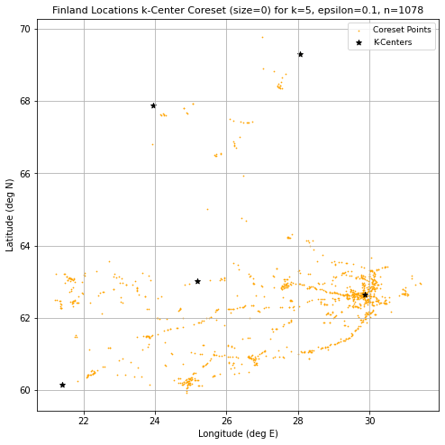

## Coreset Algorithms for Streaming & Clustering
------------------------------------------------------
Python implementation of various Coreset algorithms for clustering and streaming. The code in this repository can be used to generate Coresets for the following use-cases. 
1. Median Estimation
2. k-Center Clustering
3. Minimum Enclosing Ball (MEB)
4. Gaussian Mixture Model (GMM)
5. Weighted GMM
6. Streaming Coresets (k-means/k-median)

 

Note that all algorithms use the following standard Python libraries: numpy, pandas, matplotlib.pyplot, time. The code contains further documentation about parameters and values relevant to the algorithms. `helper_functions.py` and `coreset_util.py` contain some common functions used across the other modules. The `data` folder contains 2 datasets: UN CO2 Emissions and Finland 2012 Locations data.

### Implementation details:
------------------------------------------------------
***Median Estimation***

The class `Coreset_Median` in ```algorithms/coreset_median.py``` contains the implementation of an (epsilon*n) median approximation algorithm. The ```notebooks/median_test.ipynb``` notebook contains code to test the implementation against numpy.median and generate runtime and median estimation plots (see sample plots below)

 

***Minimum Enclosing Ball***

The class `Coreset_MinimumEnclosingBall` in ```algorithms/coreset_meb.py``` contains the implementation of algorithm to compute the Minimum Enclosing Ball on a given set of input points. The algorithm currently supports 2D data and the ```compute_minimumEnclosingBall()``` function can be used to run the algorithm and populate the array `self.meb_vector` with the points in the minimum enclosing ball. The ```test/kcenter_meb_test.ipynb``` notebook contains code to test the implementation and generate 2D plots for MEB (see sample plots below)

 

***k-center Clustering***

The `Coreset_kCenter` class in ```algorithms/coreset_kcenter.py``` contains the implementation of an epsilon-additive k-center clustering coresest algorithm. The algorithm supports d-dimensional (d > 1) data and the `compute_kCenter_Coreset()` function can be used to run the algorithm and populate the array `self.coreSet_array` with the points in the Coreset. The function `greedy_kcenter()` computes a 2-approximation for the k-center clustering, and can be re-used to plot the k-center clustering using the coreset as input. 

The ```notebooks/kcenter_meb_test.ipynb``` notebook contains code to test the implementation and generate 2D plots for k-center coresets. The following plots show a sample k-center coreset for the Finland 2012 locations dataset (available in the `data` folder).

 


***Gaussian Mixture Models***

The `Coreset_GMM` class in ```algorithms/coreset_gmm.py``` contains the implementation of the GMM coreset construction algorithm outlined in Lucic et al (2018). The class supports d-dimensional data. The primary method `generate_coreset()` returns a tuple containing the GMM coreset, the first element being the sampled points with the second containing the associated coreset weights. 

The `Weighted_GMM` class in ```algorithms/coreset_gmm.py``` contains the implementation of a generalization of the standard GMM model that applies to weighted input points. In particular, the `fit()` method executes a modified version of the EM algorithm that takes into account the point weights. The standard EM algorithm can easily be recovered by not specifying a weight argument. However, the addition of the weighted option allows one to fit a GMM model on a coreset produced by `Coreset_GMM`. 

The file ```algorithms/helper_functions.py``` contains a variety of functions that are leveraged in the `Coreset_GMM` and `Weighted_GMM` classes. In particular, this file contains functions implementing distance metrics, weighted k-means, k-means++, GMM data simulation, and scatter plots. 

The file ```presentation/gmm_coreset_analysis.py``` contains an example analysis of the GMM coresets using the `Coreset_GMM` and `Weighted_GMM` classes. This file also leverages the functions in ```helper_functions.py``` to simulate artificial data sampled from a GMM. In general, this is a good starting point to learn how to use the GMM coreset functionality. The plots shown below were produced using this script. 

The file ```gmm_test.py``` contains further examples of how to use `Coreset_GMM`, `Weighted_GMM`, and the functions in ```helper_functions.py```. It contains simple tests evaluating the various algorithms. 

***Streaming Algorithms***

K-means and K-medians algorithms have been implemented. The class that handles these algorithms is in `Coreset_Streaming` in  ```algorithms/coreset_streaming.py```.

The easiest way to simulate the streaming algorithm would be to run the ```run_stream(stream, max_cs_size=1000)``` function, which returns a coreset.The algorithm returns a coreset, in the form of a list of `(point, weight)`, which can be used to run weighted k-means and k-medians on. Specifically, the functions to run k-means are ```weighted_kmeans()``` and ```weighted_kmedians``` in ```algorithms/helper_functions.py```

A demonstration can be seen through the `get_true_and_coreest_kmeans_centers()` function in the ```notebooks/coreset_streaming_playbook.ipynb``` notebook. This notebook should be used for general reference for the usage of the streaming class.


### References
------------------------------------------------------
1. Pankaj K. Agarwal, , Sariel Har-Peled, and Kasturi R. Varadarajan. "Geometric approximation via coresets." Combinatorial and computational geometry 52.1-30 (2005): 3.
2. Feldman, Dan, Matthew Faulkner, and Andreas Krause. "Scalable Training of Mixture Models via Coresets." NIPS. 2011.
3. Sariel Har-Peled, and Soham Mazumdar. "On coresets for k-means and k-median clustering." Proceedings of the thirty-sixth annual ACM symposium on Theory of computing. 2004.
4. Mario Lucic, Matthew Faulkner, Andreas Krause, and Dan Feldman. “Training Gaussian Mixture Models at Scale via Coresets.” Journal of Machine Learning Research. 2018. 

------------------------------------------------------
#### CS 543: Algorithms for Big Data (Boston University, Dec 2021)
Andrew Roberts, Karan Vombatkere, Bhushan Suwal
